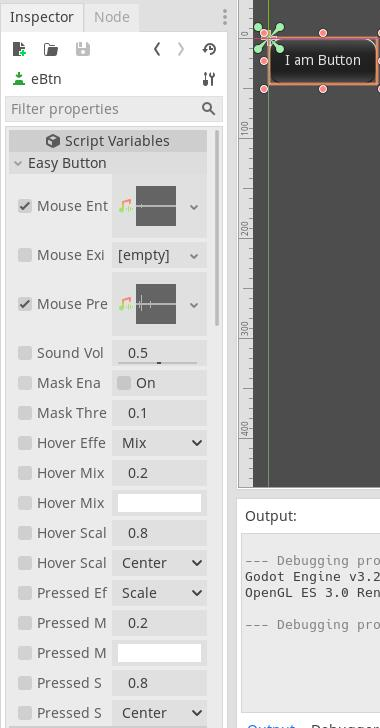

# easyButton
Godot plugin. For quick set button sound and hover, pressed effect.
 
Need myTheme plugin.

# Document
[Chinese document link](https://shimo.im/docs/Pkpg6qghw8jTyDdJ/)

# Screenshot

# Installing
[Installing plugins](https://docs.godotengine.org/en/stable/tutorials/plugins/editor/installing_plugins.html)
